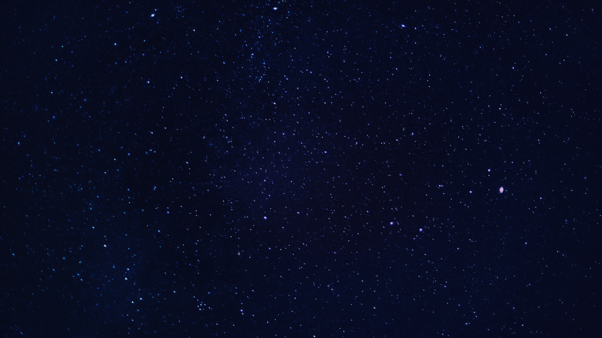

# EzenPoter
>[!Note]
> EZEN Academy Project  
> Topic : Harry Poter Level Test  
> 2023.10.02 ~ 2023.10.31

**Using**
  

**Function**

- [x] Login Window
- [x] Background Music
- [x] Level Test
- [ ] Dormitory Test
- [ ] Select Cane
- [ ] Result Page
- [ ] Import Picture
- [ ] Save Result
- [ ] Share Result
- [ ] Side Menu

 
